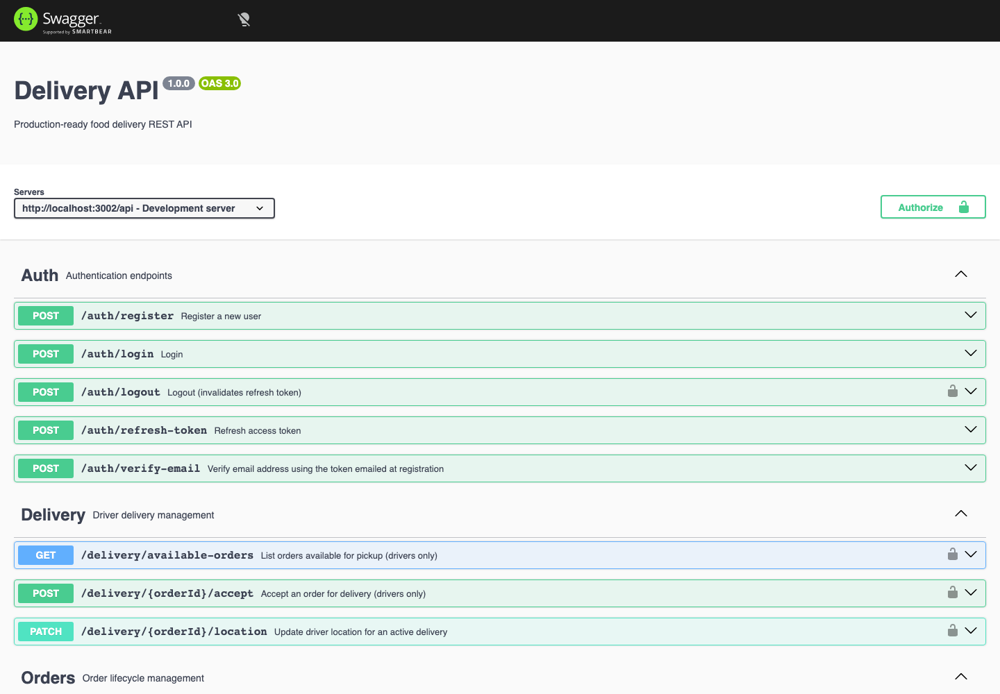

# 🛵 Delivery API

> A production-shaped REST API for a food delivery platform — demonstrating three real-world backend patterns: JWT auth with hashed refresh-token rotation, Stripe-integrated payments, and real-time order tracking over Socket.io — in one cohesive Express + TypeScript codebase.




---

## ✨ Features

- 🔐 **Auth** — JWT access/refresh tokens, refresh tokens stored SHA-256 hashed (never plaintext), email verification via a hashed, expiring token sent by email
- 🛡️ **Role-based access control** — `CUSTOMER`, `DRIVER`, `ADMIN`, enforced per-route
- 🍽️ **Restaurants & menus** — CRUD with ownership checks, pagination, search and filtering
- 📦 **Orders** — server-computed totals from live menu prices, an explicit status state machine (`PENDING → CONFIRMED → PREPARING → PICKED_UP → DELIVERED`, or `CANCELLED`)
- 💳 **Payments** — Stripe PaymentIntents with a signature-verified webhook
- 🛵 **Live delivery tracking** — Socket.io, JWT-authenticated handshake, per-order rooms, driver-ownership-checked location updates
- ⚙️ **Background jobs** — BullMQ/Redis queues for transactional email and order-status notifications
- 📖 **Validation & docs** — Zod schemas on every route, OpenAPI/Swagger generated from JSDoc and served at `/api/docs`

---

## 🛠️ Tech Stack

| Layer | Technology |
|---|---|
| Runtime | Node.js 20, TypeScript |
| Framework | Express |
| Database | PostgreSQL, via Prisma ORM |
| Cache / queues | Redis, BullMQ |
| Real-time | Socket.io |
| Payments | Stripe |
| Validation | Zod |
| API docs | Swagger (OpenAPI 3) |
| Auth | JWT (jsonwebtoken), bcryptjs |
| Testing | Jest, ts-jest |
| DevOps | Docker, docker-compose |

---

## 🏗️ Architecture

```
┌────────────────────┐        HTTPS / WS               ┌───────────────────────────────┐
│  Client (web/mobile) │ ───────────────────────────────▶│   Express API (Node 20 + TS)   │
│                      │◀─────────────────────────────── │                                 │
└────────────────────┘      JSON / Socket.io events      │  routes/ → validate (Zod) →     │
                                                            │  authenticate/authorize →       │
                                                            │  controllers/ → services/       │
                                                            │                                 │
                                                            │  services/ ─────────────────────┼──▶ PostgreSQL (Prisma)
                                                            │   ├─ auth.service.ts             │
                                                            │   ├─ order.service.ts            │
                                                            │   ├─ payment.service.ts ─────────┼──▶ Stripe
                                                            │   └─ delivery.service.ts         │
                                                            │                                 │
                                                            │  jobs/ (BullMQ workers) ─────────┼──▶ Redis
                                                            │                                 │
                                                            │  sockets/ (Socket.io) ───────────┼──▶ live order/delivery rooms
                                                            └───────────────────────────────┘
```

`routes/` → `middlewares/` (auth, rbac, validate, error) → `controllers/` (thin HTTP adapters) → `services/` (business logic + Prisma queries) → `config/` (one client per external dependency). Environment variables are validated once at boot with a Zod schema (`src/config/env.ts`) — the process refuses to start if a required variable is missing or malformed.

---

## 🚀 Getting Started

### Prerequisites

- Docker and Docker Compose (recommended), **or** local Node.js 20+, PostgreSQL 16, and Redis 7.

### Run with Docker (recommended)

```bash
git clone https://github.com/petryk-dev/delivery-api.git
cd delivery-api
cp .env.example .env
# edit .env — at minimum set JWT_ACCESS_SECRET / JWT_REFRESH_SECRET (openssl rand -hex 64),
# and your Stripe / SMTP credentials if you're exercising those flows.

docker compose up -d --build
docker compose exec app npx prisma migrate deploy
docker compose exec app npx prisma db seed   # optional: sample admin/owner/customer + restaurant
```

The API is now running at `http://localhost:3002`, with docs at `http://localhost:3002/api/docs`.

### Run locally without Docker

```bash
npm install
cp .env.example .env   # point DATABASE_URL / REDIS_HOST at your local instances
npx prisma migrate dev
npm run dev             # http://localhost:3002
```

### Useful scripts

| Command | Description |
|---|---|
| `npm run dev` | Start the API in watch mode |
| `npm run build` | Compile TypeScript to `dist/` |
| `npm start` | Run the compiled build |
| `npm test` | Run the Jest test suite |
| `npm run lint` | Lint `src/` with ESLint |
| `npm run prisma:migrate` | Create/apply a dev migration |
| `npm run prisma:migrate:prod` | Apply migrations in production (`prisma migrate deploy`) |
| `npm run prisma:seed` | Seed sample users, a restaurant, and menu items |
| `npm run prisma:studio` | Open Prisma Studio |

---

## 🔑 Environment Variables

All variables are validated at boot (`src/config/env.ts`); the process exits immediately if one is missing or malformed. See [`.env.example`](.env.example) for a ready-to-copy template — it ships with placeholders only, never real credentials.

| Variable | Required | Description |
|---|:---:|---|
| `NODE_ENV` | – | `development` \| `production` \| `test`, defaults to `development` |
| `PORT` | – | HTTP port, defaults to `3002` |
| `API_PREFIX` | – | Base path for all API routes, defaults to `/api` |
| `DATABASE_URL` | ✅ | PostgreSQL connection string |
| `REDIS_HOST` / `REDIS_PORT` | – | Default to `localhost` / `6379` |
| `REDIS_PASSWORD` | – | Optional |
| `JWT_ACCESS_SECRET` | ✅ | Signs access tokens (min 32 chars) |
| `JWT_REFRESH_SECRET` | ✅ | Signs refresh tokens (min 32 chars) |
| `JWT_ACCESS_EXPIRES_IN` / `JWT_REFRESH_EXPIRES_IN` | – | Default to `15m` / `7d` |
| `STRIPE_SECRET_KEY` | ✅ | Stripe secret key (`sk_...`) |
| `STRIPE_WEBHOOK_SECRET` | ✅ | Stripe webhook signing secret (`whsec_...`) |
| `GOOGLE_MAPS_API_KEY` | ✅ | Geocoding/ETA — currently stubbed |
| `SMTP_HOST` / `SMTP_PORT` / `SMTP_USER` / `SMTP_PASS` | ✅ | Outbound email (Nodemailer); `SMTP_PORT` defaults to `587` |
| `EMAIL_FROM` | ✅ | From-address for outbound email |
| `CORS_ORIGIN` | – | Allowed origin for browser clients, defaults to `*` |
| `RATE_LIMIT_WINDOW_MS` / `RATE_LIMIT_MAX` | – | Global rate limit window and cap, default `900000` / `100` |
| `AUTH_RATE_LIMIT_MAX` | – | Cap for `/auth/*` endpoints in the same window, defaults to `10` |
| `LOG_LEVEL` / `LOG_DIR` | – | Default to `debug` / `logs` |

---

## 🧪 Testing

```bash
npm test
```

Tests are unit-level and mock the Prisma client and job queues, so they run without a live database or Redis instance. Coverage focuses on the auth flow (registration, login, refresh-token rotation, email verification) and the order lifecycle (total computation, status transitions).

---

## 📦 Deployment

The app ships as a multi-stage [`Dockerfile`](Dockerfile) — `npm ci`, `prisma generate`, `tsc` build in one stage, production-only deps and a regenerated Prisma client in the final stage, running as a non-root user with a built-in healthcheck. It deploys anywhere that runs containers (Railway, Fly.io, Render, ECS, a VPS):

1. Provision managed PostgreSQL and Redis instances.
2. Set the environment variables from the table above on the host.
3. Build and run the image (`docker build -t delivery-api .`), or use [`docker-compose.yml`](docker-compose.yml) as a reference for wiring the app to its dependencies.
4. Run `npx prisma migrate deploy` against the production database before traffic hits the new instance.

---

## ⚙️ How It Works

**Auth** — Registration hashes the password with bcrypt and issues a JWT access/refresh pair; the refresh token is stored as a SHA-256 hash, never in plaintext, so a database read alone can't yield a usable session. A separate, hashed, 24-hour-expiring token is emailed for verification — `/auth/verify-email` checks it against the stored hash, matching real email-ownership proof rather than trusting a logged-in session. A refresh-token mismatch (stale or replayed) revokes the stored session outright instead of just failing the one request.

**Orders & payments** — Order totals are computed server-side from live menu prices, never trusted from the client. Status changes move through an explicit state machine (`PENDING → CONFIRMED → PREPARING → PICKED_UP → DELIVERED`, or `CANCELLED` from an early state), with role checks on top — customers can only cancel. Payment goes through a Stripe PaymentIntent tied to the order; the webhook handler verifies Stripe's signature before ever touching the database.

**Real-time delivery tracking** — Socket.io connections authenticate with the same JWT used for REST calls. When a driver streams a location update over the socket, the handler delegates into the identical `delivery.service` function the REST `PATCH /delivery/:orderId/location` endpoint uses — so the ownership check (this driver must own this delivery) lives in exactly one place instead of being duplicated, and possibly drifting, between the two transports.

---

## 📚 What I Learned

- Rotating and hashing refresh tokens correctly, including revoking a session on a reuse/mismatch instead of only rejecting the one request
- Building a real email-verification flow (hashed, expiring, out-of-band token) instead of trusting an authenticated session
- Keeping authorization logic in one place when the same action is reachable over both REST and Socket.io
- Structuring background work (transactional email, order-status fan-out) through BullMQ so request handlers stay fast
- Writing a Prisma migration and generating the client without a live database connection, for CI environments that don't have one
- Unit-testing service-layer logic by mocking the Prisma client and job queues, so the suite runs without a live database or Redis
- Building a production Docker image: multi-stage build, non-root user, healthcheck, and a Prisma client regenerated against the runtime image's engine target

---

## 👤 Author

**Volodymyr Petryk**

[LinkedIn](https://linkedin.com/in/volodymyr-petryk) · [petryk.developer@gmail.com](mailto:petryk.developer@gmail.com)
